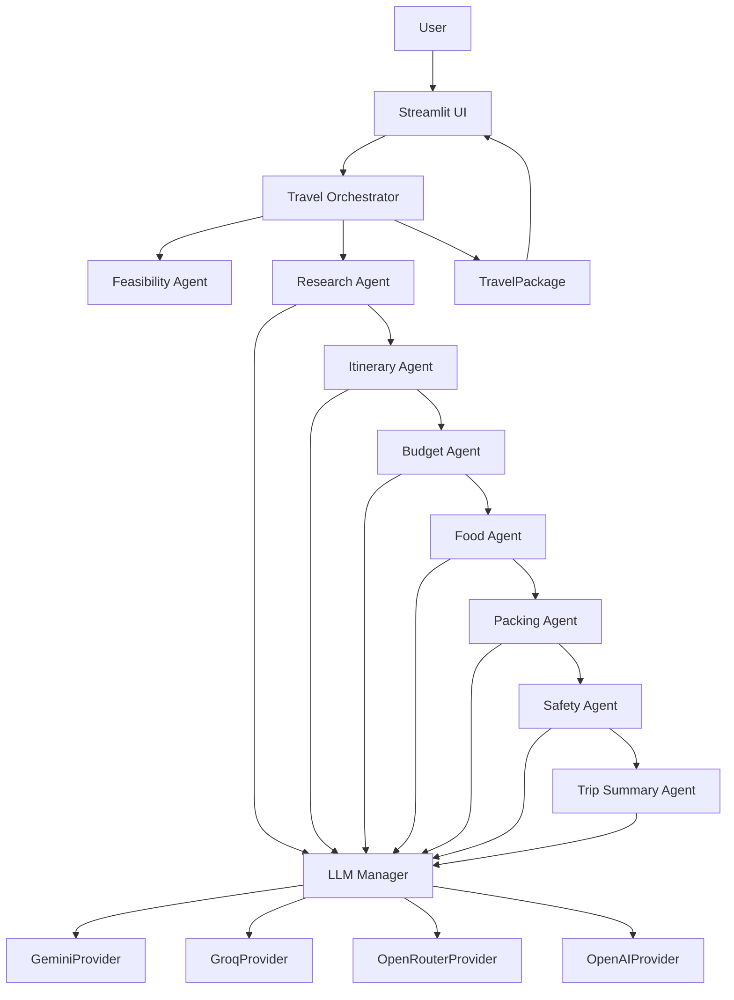

# TripMind AI

TripMind AI is a multi-agent travel planning assistant. Users enter a destination, number of days, budget, persona, and interests. The app then generates destination research, feasibility analysis, a day-wise itinerary, budget allocation, local food recommendations, packing checklist, travel safety tips, trip intelligence, AI insights, and an executive trip summary through a modular orchestration layer.

The LLM stack is provider-agnostic with automatic failover across Gemini, Groq, OpenRouter, and OpenAI.

## Project Overview

This MVP focuses on the core travel planning workflow only.

Included in V1:
- Streamlit UI
- Provider-agnostic LLM manager with failover
- Pydantic travel request model
- Feasibility agent
- Research agent
- Five specialized planning agents
- Trip summary agent
- SQLite trip history
- PDF travel dossier export
- Travel orchestrator
- Result dashboard

Excluded from V1:
- Authentication
- PDF export
- SQLite persistence
- Saved trips
- External APIs
- Maps
- Weather
- CrewAI, SmolAgents, LangGraph, AutoGen

## Architecture Diagram



## Failover Strategy

- Provider priority order: Gemini, Groq, OpenRouter, OpenAI
- Retries per provider: 2 retries with exponential backoff (1s, 2s)
- Cooldown: failed providers are skipped for 5 minutes
- Health tracking: provider name, healthy flag, failure count, last failure time, cooldown window
- Logging: provider selection, failures, failovers, recoveries, and successful responses

## Agent Workflow

1. The user submits a trip request in Streamlit.
2. The UI validates input and creates a `TravelRequest` with a persona.
3. The `TravelOrchestrator` runs the feasibility agent first.
4. The orchestrator runs the research agent and then passes research context into the itinerary, budget, food, packing, safety, and summary agents.
5. Each agent calls the shared `LLMManager`, which handles provider selection and failover.
6. Responses are validated with Pydantic models before rendering.
7. The orchestrator aggregates results into a `TravelPackage`.
8. The UI renders feasibility, analytics, timeline cards, recent trips, and summary metrics.

## Tech Stack

- Python
- Streamlit
- Gemini 2.5 Flash
- Pydantic
- dotenv
- reportlab
- SQLite

## Installation Guide

1. Create and activate a virtual environment.
2. Install dependencies:

```bash
pip install -r requirements.txt
```

3. Add your Gemini API key to `.env`:

```env
GEMINI_API_KEY=your_api_key_here
GROQ_API_KEY=your_groq_key_here
OPENROUTER_API_KEY=your_openrouter_key_here
OPENAI_API_KEY=your_openai_key_here
```

4. Run the app:

```bash
streamlit run app.py
```

## Environment Variables

- `GEMINI_API_KEY`: Gemini API key.
- `GROQ_API_KEY`: Groq API key.
- `OPENROUTER_API_KEY`: OpenRouter API key.
- `OPENAI_API_KEY`: OpenAI API key.

## Future Enhancements

- Authentication
- Maps and weather integrations
- Swappable agent backends for SmolAgents or other orchestration frameworks
- Richer structured output validation and retry logic
