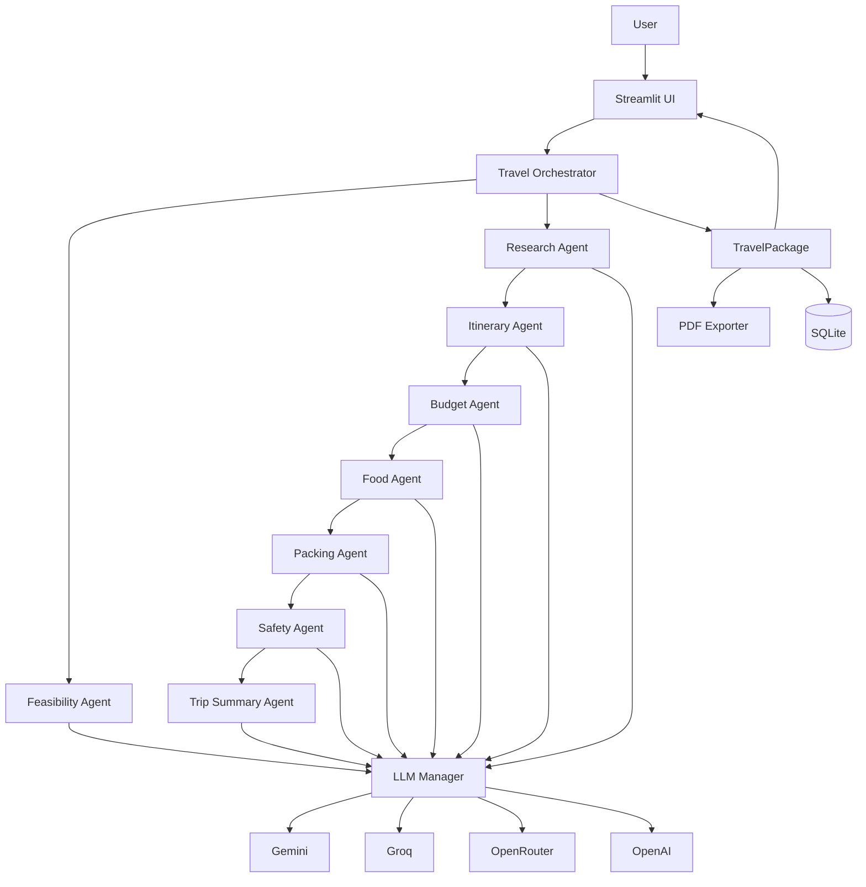
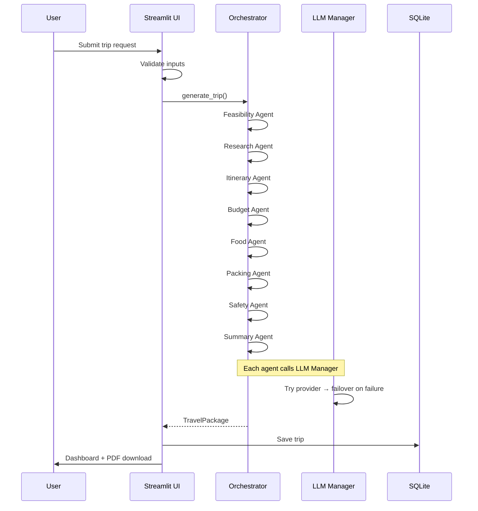

# TripMind AI

TripMind AI is a multi-agent travel planning assistant built for hackathon deployment. Users enter a destination, budget, duration, persona, and interests. The app generates destination research, feasibility analysis, a day-wise itinerary, budget allocation, food recommendations, packing checklist, safety tips, AI insights, and a professional PDF travel dossier.

The LLM stack is provider-agnostic with automatic failover across **Gemini**, **Groq**, **OpenRouter**, and **OpenAI**.

---

## Features

| Feature | Description |
|---------|-------------|
| Multi-Agent Workflow | 8 specialized agents orchestrated in sequence |
| Provider Failover | Automatic retry and fallback across 4 LLM providers |
| Feasibility Analysis | Pre-flight validation of budget, duration, and persona fit |
| Trip Intelligence | Trip score, budget fit, difficulty, and analytics |
| Premium Streamlit UI | Dark theme, glassmorphism cards, progress tracking |
| SQLite Trip History | Search, open, duplicate, delete, and reuse saved trips |
| PDF Travel Dossier | Professional ReportLab export with cover page and sections |
| Developer Mode | Hidden sidebar toggle for internal debugging (off by default) |

---

## Architecture Diagram



---

## Workflow Diagram



---

## Folder Structure

```
travel_planner/
├── app.py                      # Streamlit entry point
├── requirements.txt
├── README.md
├── agents/
│   ├── feasibility_agent.py
│   ├── research_agent.py
│   ├── itinerary_agent.py
│   ├── budget_agent.py
│   ├── food_agent.py
│   ├── packing_agent.py
│   ├── safety_agent.py
│   └── trip_summary_agent.py
├── models/
│   ├── travel_request.py
│   ├── travel_package.py
│   ├── agent_outputs.py
│   ├── feasibility.py
│   └── trip_intelligence.py
├── orchestrator/
│   └── travel_orchestrator.py
├── services/
│   ├── llm/
│   │   ├── llm_manager.py
│   │   ├── provider_registry.py
│   │   └── providers/
│   ├── pdf_exporter.py
│   ├── trip_history_db.py
│   ├── prompt_service.py
│   └── response_parser.py
├── ui/
│   ├── theme.py                # Custom CSS
│   └── components.py           # UI render components
└── utils/
    ├── validators.py
    └── trip_helpers.py
```

---

## Installation

```bash
cd travel_planner
python -m venv .venv

# Windows
.venv\Scripts\activate

# macOS/Linux
source .venv/bin/activate

pip install -r requirements.txt
```

---

## Environment Variables

Create a `.env` file in the `travel_planner` directory:

```env
GEMINI_API_KEY=your_gemini_key
GROQ_API_KEY=your_groq_key
OPENROUTER_API_KEY=your_openrouter_key
OPENAI_API_KEY=your_openai_key
```

At least one provider key is required. Gemini is tried first by default.

| Variable | Provider |
|----------|----------|
| `GEMINI_API_KEY` | Google Gemini 2.5 Flash |
| `GROQ_API_KEY` | Groq |
| `OPENROUTER_API_KEY` | OpenRouter |
| `OPENAI_API_KEY` | OpenAI |

---

## Run Locally

```bash
streamlit run app.py
```

The app opens at `http://localhost:8501`.

---

## Deployment Guide

### Streamlit Community Cloud

1. Push the repository to GitHub.
2. Go to [share.streamlit.io](https://share.streamlit.io).
3. Connect your repo and set **Main file path** to `travel_planner/app.py`.
4. Add secrets (API keys) in the Streamlit Cloud secrets manager:

```toml
GEMINI_API_KEY = "your_key"
GROQ_API_KEY = "your_key"
```

5. Deploy.

### Docker (optional)

```dockerfile
FROM python:3.11-slim
WORKDIR /app
COPY requirements.txt .
RUN pip install -r requirements.txt
COPY . .
EXPOSE 8501
CMD ["streamlit", "run", "app.py", "--server.port=8501", "--server.address=0.0.0.0"]
```

---

## How Provider Failover Works

1. **Startup**: Each provider is health-checked once (API key configured = healthy).
2. **Generation**: The LLM Manager tries the current provider without re-checking health.
3. **On success**: Response is returned; provider stays active.
4. **On failure**: Up to 2 retries with exponential backoff, then failover to the next provider.
5. **Cooldown**: Failed providers are skipped for 5 minutes before retry.
6. **UI**: Provider status and failover events appear in the sidebar — not in raw terminal output.

Priority order: **Gemini → Groq → OpenRouter → OpenAI**

---

## How Multi-Agent Workflow Works

1. User submits a validated `TravelRequest`.
2. `TravelOrchestrator` runs agents in sequence:
   - **Feasibility** — validates budget/duration/persona fit
   - **Research** — destination intelligence (cached per destination)
   - **Itinerary** — day-wise morning/afternoon/evening plan
   - **Budget** — category allocation
   - **Food** — local cuisine recommendations
   - **Packing** — categorized checklist
   - **Safety** — tips, warnings, etiquette
   - **Summary** — executive summary, AI insights, trip intelligence
3. Each agent calls the shared `LLMManager` with Pydantic-validated outputs.
4. Results aggregate into a `TravelPackage` for UI rendering and PDF export.

---

## Performance Optimizations

- `st.cache_resource` caches the orchestrator, SQLite DB, and PDF exporter across reruns
- Provider health checks run only at application startup
- Destination research is cached per agent instance
- Logging defaults to WARNING — clean terminal during demos

---

## Screenshots

> Add screenshots of the hero section, loading workflow, results dashboard, and PDF export after deployment.

| Screen | Description |
|--------|-------------|
| Hero | TripMind AI branding with feature badges |
| Loading | 9-stage progress workflow |
| Dashboard | Metric cards, tabs for itinerary/budget/food/packing/safety |
| Sidebar | Trip history, provider status, developer mode |
| PDF | Professional travel dossier with cover page |

---

## Pre-Deployment Checklist

- [ ] Provider failover with at least 2 API keys configured
- [ ] Orchestrator generates full TravelPackage
- [ ] SQLite saves and loads trips
- [ ] PDF export downloads successfully
- [ ] Trip history search, open, duplicate, delete
- [ ] All 8 agents produce valid JSON
- [ ] No raw JSON visible in UI (developer mode off)
- [ ] No repeated health checks in terminal
- [ ] Orchestrator not recreated on every rerun
- [ ] Progress bar tracks all 9 workflow stages
- [ ] Friendly error cards on failure

---

## Tech Stack

- Python 3.11+
- Streamlit
- Pydantic
- ReportLab (Platypus)
- SQLite
- Google Gemini / Groq / OpenRouter / OpenAI

---

## License

MIT — hackathon use.
