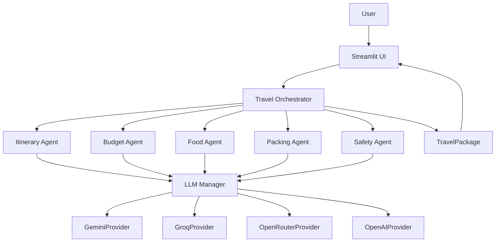

# TripMind AI

TripMind AI is a Version 1 MVP for AI-powered travel planning. Users enter a destination, number of days, budget, travel style, and interests. The app then generates a personalized itinerary, budget allocation, local food recommendations, packing checklist, and travel safety tips through a modular orchestration layer.

The LLM stack is provider-agnostic with automatic failover across Gemini, Groq, OpenRouter, and OpenAI.

## Project Overview

This MVP focuses on the core travel planning workflow only.

Included in V1:
- Streamlit UI
- Gemini service layer
- Pydantic travel request model
- Five specialized agents
- Travel orchestrator
- Result dashboard

Excluded from V1:
- Authentication
- PDF export
- SQLite persistence
- Saved trips
- External APIs
- Maps
- Weather
- CrewAI, SmolAgents, LangGraph, AutoGen

## Architecture Diagram



## Failover Strategy

- Provider priority order: Gemini, Groq, OpenRouter, OpenAI
- Retries per provider: 2 retries with exponential backoff (1s, 2s)
- Cooldown: failed providers are skipped for 5 minutes
- Health tracking: provider name, healthy flag, failure count, last failure time, cooldown window
- Logging: provider selection, failures, failovers, recoveries, and successful responses

## Agent Workflow

1. The user submits a trip request in Streamlit.
2. The UI validates input and creates a `TravelRequest`.
3. The `TravelOrchestrator` runs the agents in sequence.
4. Each agent uses `GeminiService` to generate structured output.
5. The orchestrator aggregates results into a `TravelPackage`.
6. The UI renders the final trip plan in tabs.

## Tech Stack

- Python
- Streamlit
- Gemini 2.5 Flash
- Pydantic
- dotenv
- SQLite: not used in V1

## Installation Guide

1. Create and activate a virtual environment.
2. Install dependencies:

```bash
pip install -r requirements.txt
```

3. Add your Gemini API key to `.env`:

```env
GEMINI_API_KEY=your_api_key_here
```

4. Run the app:

```bash
streamlit run app.py
```

## Environment Variables

- `GEMINI_API_KEY`: Gemini API key.
- `GROQ_API_KEY`: Groq API key.
- `OPENROUTER_API_KEY`: OpenRouter API key.
- `OPENAI_API_KEY`: OpenAI API key.

## Future Enhancements

- Trip saving and history
- PDF export
- Authentication
- SQLite persistence
- Maps and weather integrations
- Swappable agent backends for SmolAgents or other orchestration frameworks
- Richer structured output validation and retry logic
